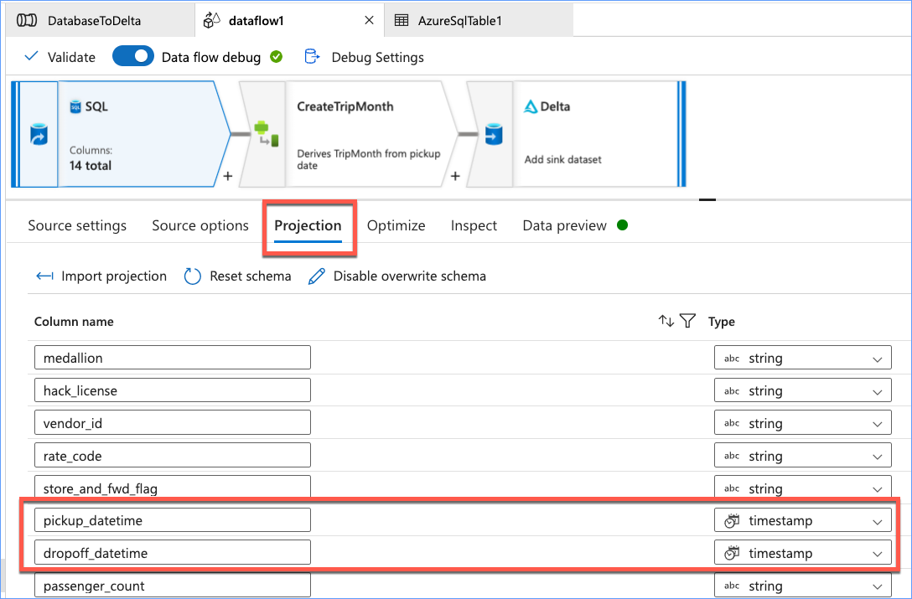
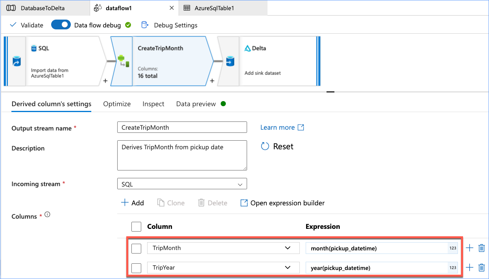
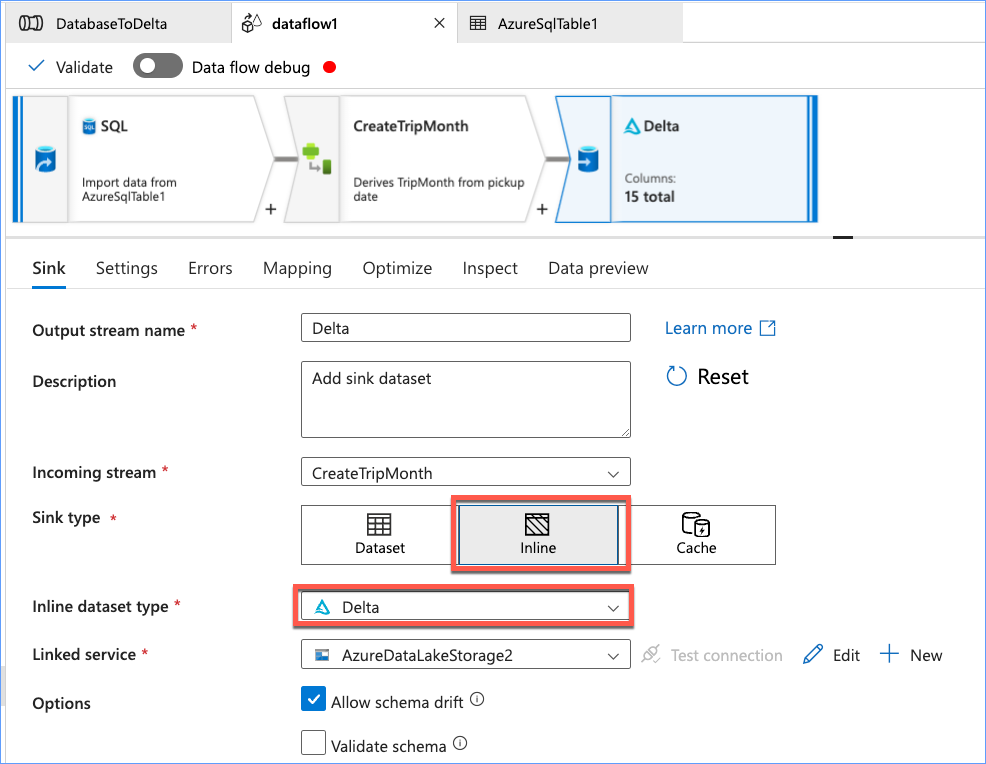
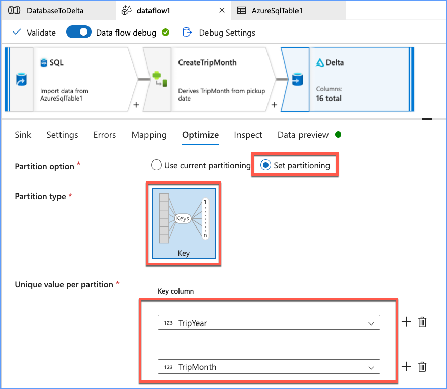
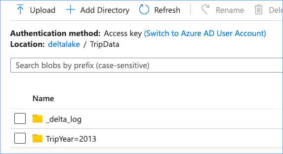
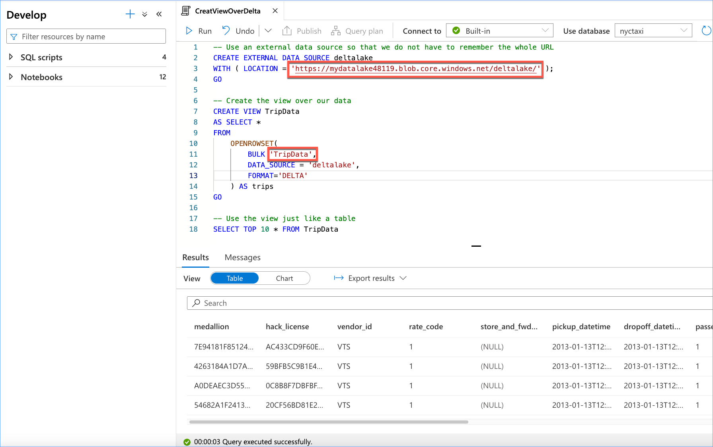

# Azure Data Factory Data Flow Partitioning Example

This example is provided as-is and is not supported in any way by me or Microsoft. Feel free to provide feedback but I can not guarantee that it will be addressed.

The example is designed to highlight one way in which you can partition data using a Data Flow. It is not intended to be best practice for every possible scenario.

## Guide

This example will be a VERY simple pipeline with a Data Flow. It is extracting data from an Azure SQL Database where I have the TripData from the NY taxi-data dataset, and then generating derived columns called TripYear and TripMonth which we will then use as our partition keys when we write our data out in Delta format to our data lake. Finally, we create a view on top of this data in our Azure Synapse Serverless SQL instance to make the data available.

### Creating the Data Flow

I am not going to step through the individual steps to create the Data Flow, mearly to point out the changes that are necessary to do the partitioning.

The first thing you will need to do is to create a SQL source and connect it to your database and table. You will then need to update your source projections. By default, your source will project all of your columns to strings. You will need to change your datetime columns to timestamp types so that they can be used in the next step.

Next, you will need to create a derived column transformation. On the derived column settings tab, you want to add a column called TripYear, the expression will be __year(pickup_datetime)__. You can just type it in or you can use the expression builder. This function takes in a timestamp and extracts the year. This will become the value of our new TripYear column. Create another column called TripMonth with the expression __month(pickup_datetime) At this point I would recommend you scroll through the functions available in the expression builder to give you an idea of what is available there.

Next you will create your Delta lake sink and connect it to you Azure Data Lake. Note that to create this you will need to select the __Inline__ sink type, then choose __Delta__ as the inline dataset type.

After you have setup all of your required configurations for the Delta sink, move to the __Optimize__ tab. Choose __Set partitioning__ for the partition option. Then choose __Key__ for the partition type. And then choose __TripYear__ as the key column. Create another key column and choose __TripMonth__. This will partition your output data by year and month and allow for partition elimination at the year and month levels. 

After publishing and running your pipeline. Navigate to your Azure Data Lake and open the folder where you wrote your data. You should see a folder called __\_delta\_log__ where changes will be tracked and one folder for each partition in your data. In my example I only had a single months worth of data so I only have one partition folder. If you drill into your partition folders you will see the parquet file which holds the data for that partition.

Now we want to create a view in Synapse Serverless SQL. If you do not have a database created yet, you can do that now. If you stored your data in an account other than the default data lake that is installed with Synapse, you will need to configure access for that. 

Within your Synapse workspace, create a new SQL script, connect it to your database. Copy and paste the following code into the script window, update the __location__ with the URL for your datalake and update the __BULK__ parameter of the openrowset command with the folder for your Delta table and execute the code. 

    -- Use an external data source so that we do not have to remember the whole URL
    CREATE EXTERNAL DATA SOURCE deltalake
    WITH ( LOCATION = 'https://mydatalake48119.blob.core.windows.net/deltalake/' );
    GO
    
    -- Create the view over our data
    CREATE VIEW TripData
    AS SELECT *
    FROM
        OPENROWSET(
            BULK 'TripData',
            DATA_SOURCE = 'deltalake',
            FORMAT='DELTA'
        ) AS trips
    GO
    
    -- Use the view just like a table
    SELECT TOP 10 * FROM TripData
    

